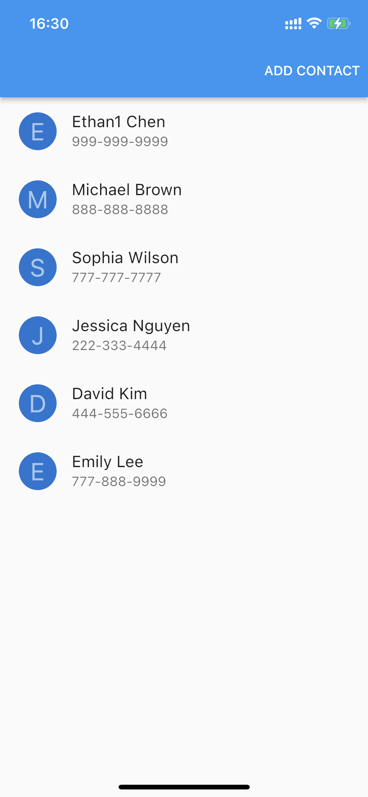

# contacts_app

A test assignment for the Eleven Systems company Flutter developer position application.

## Requirements

[Initial requirements](requirements/Eleven%20Systems%20Test%20Flutter.pdf)

Additional Requirements:

State Management: Flutter Bloc
Navigation: Go Router
Database: Objectbox

## Implementation

For ui inspiration I used  [this project](https://github.com/RogerioSobrinho/Flutter-ContactApp)


## Results 



## Running a project

Flutter version used for the project:
```
Flutter 3.3.2 • channel unknown • unknown source
Framework • revision e3c29ec00c (8 months ago) • 2022-09-14 08:46:55 -0500
Engine • revision a4ff2c53d8
Tools • Dart 2.18.1 • DevTools 2.15.0
```

In order to regenerate ObjectBox model run 
```
flutter pub run build_runner watch --delete-conflicting-outputs 
```

